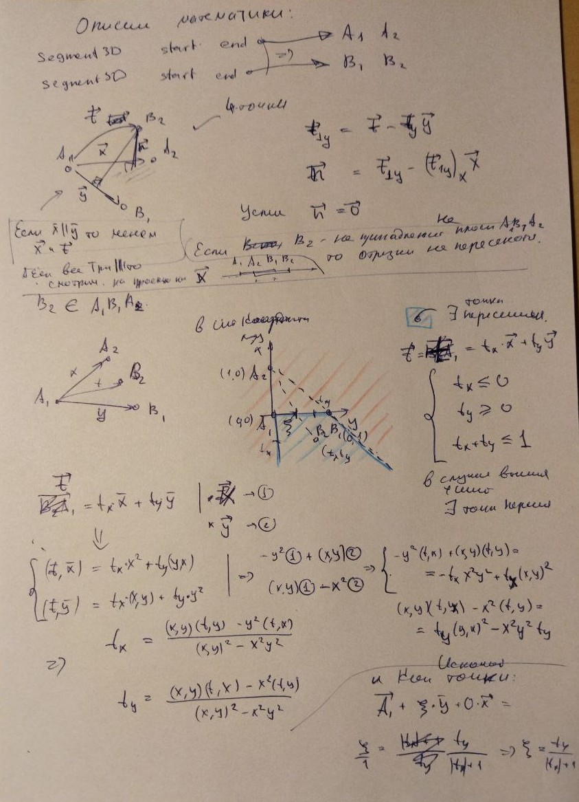

# Постановка Задачи
Есть класс трёхмерного вектора: 
```cpp
class Vector3D
{
    double X;
    double Y;
    double Z;
    ...
}
```
и трёхмерного отрезка, заданного двумя Vector3D:
```cpp
class Segment3D
{
    Vector3D start;
    Vector3D end;
    ...
}
```

Требуется написать функцию  `Intersect`, которая будет находить точку `Vector3D` пересечения двух заданных на вход `Segment3D`. В классы `Vector3D` и `Segment3D` можно добавлять любые методы.

# Описание решения

